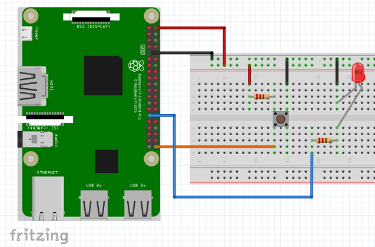
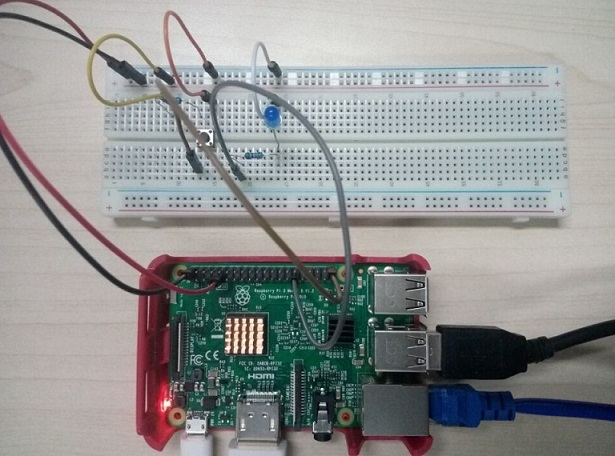
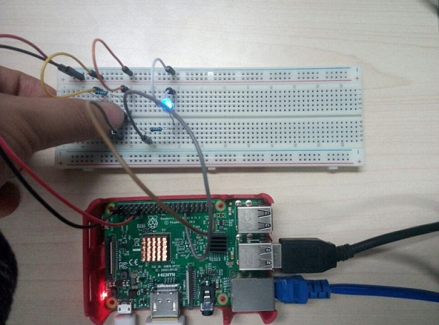

# gpiodemo
该项目演示了GPIO接口的基本使用

##  硬件准备
在运行该项目之前，我们要准备如下元器件：
* 树莓派开发板 1块
* 面包板 1块
* LED灯 1个
* 开关按钮 1个
* 电阻 2个
* 杜邦线（公对公，公对母） 若干

## 电路图


## 构建运行
1. 在Android Studio中，点击Run即可。
2. 如果你通过gradle命令进行构建，则：
```bash
gradle installDebug
adb shell am start com.chengxiang.gpiodemo/.MainActivity
```

## 运行效果
没有按下开关，LED灯不亮。



按下开关，LED灯亮了。



